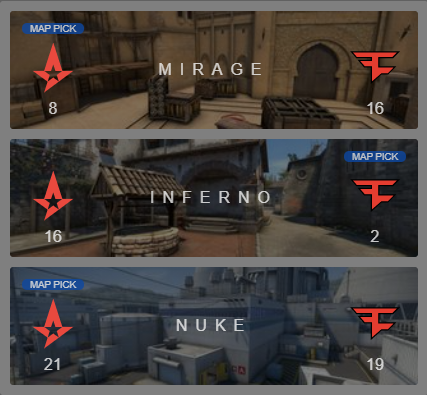

# csgo-matchboard-component

A React component to display CSGO Match information



View on [Storybook](http://csgo-matchboard-component-storybook.s3-website.eu-west-2.amazonaws.com/?path=/story/demo-matchboard--one-map)

## Usage

```js


const matchBoardData = {
  match: {
    teamOne: { imageSrc: "path/to/team-one-logo.svg" | "" },
    teamTwo: { imageSrc: "path/to/team-two-logo.svg" | "" },
    maps: [
      {
        name: "Mirage" | "Nuke" | "Overpass" | "" | ...,
        teamOneScore: number | "",
        teamTwoScore: number | "",
        mapPick: TeamIds.TEAM_ONE | TeamIds.TEAM_TWO | "",
        mapImage: "path/to/map-image.png" | "",
      },
      ...
    ],
  }
};

...

<Matchboard {...matchBoardData} />

...

```
